---
output:
  xaringan::moon_reader:
    seal: false
    css: [default,rutgers,metropolis-fonts,custom.css]
    lib_dir: libs
    nature:
      highlightStyle: googlecode
      highlightLines: true
      highlightSpans: true
      countIncrementalSlides: false
      ratio: '16:9'
    
---


```{r setup, include=FALSE}
require(knitr)
require(kableExtra)
require(tidyverse)
options(kableExtra.latex.load_packages = FALSE)
options(knitr.table.format = "html")
```

class: inverse, center, middle
background-image: url(imgs/logo.svg),url(imgs/cbi.png),url(imgs/logo_UT3_RVB.png),url(imgs/index.jpeg)
background-position: 50% 0%,25% 100%,50% 100%,75% 100%
background-size: 45%,15%,20%,10%


## .center[.large[Deep__G4:__] A deep learning approach to predict active G-quadruplexes]

### .center[SeqBim 2020]
<hr />

.large[Vincent ROCHER, Matthieu Genais, Elissar Nassereddine and Raphaël Mourad]

.large[CBI-Toulouse | Chromatin and DNA Repair | 23/11/2020]


---

## __DNA__: The secret of life 

.pull-left[
.large[
### __B-DNA__ _(1953)_
]
```{r out.width = '40%',echo=F}
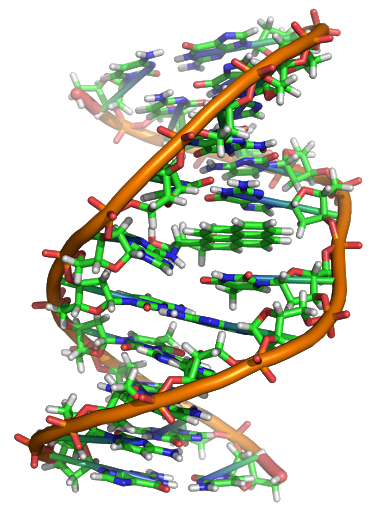
```

> The B- DNA (double helix structure) is the most stable structure.

]

.pull-right[
.large[
### __Non B-DNA__ _(1954)_
]
```{r out.width = '90%',echo=F}
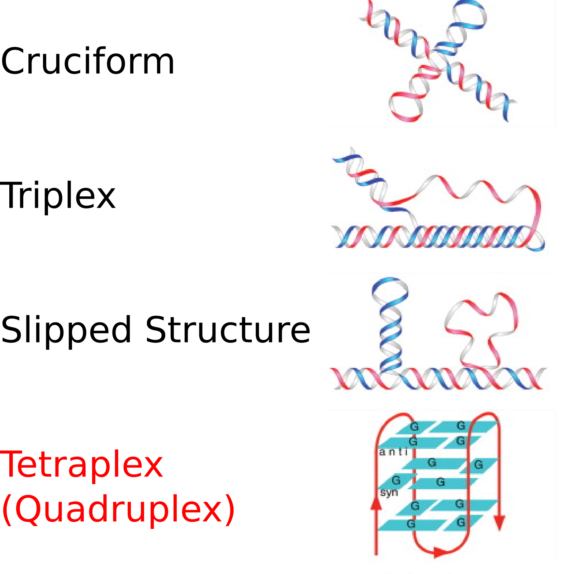
```

]

???

Alors les G quadruplexe, ou G4, sont des structures secondaires de l'ADN. Donc on connait tous la structure classique de l'ADN en double hélice, decouverte en 1953. mais il faut aussi savoir que l'ADN peut etre présent sous d'autres formes, que j'ai représenté ici, dont le G4

So the G-quadruplexes, or G4, are DNA secondary structures. So we all know the classic double helix DNA structure, discovered in 1953. But you should also know that DNA can be present in other forms, which I have represented here, including G4

---

## __G-Quadruplex (G4)__: A non B-DNA Structure
.center[
```{r out.width = '80%',echo=F}
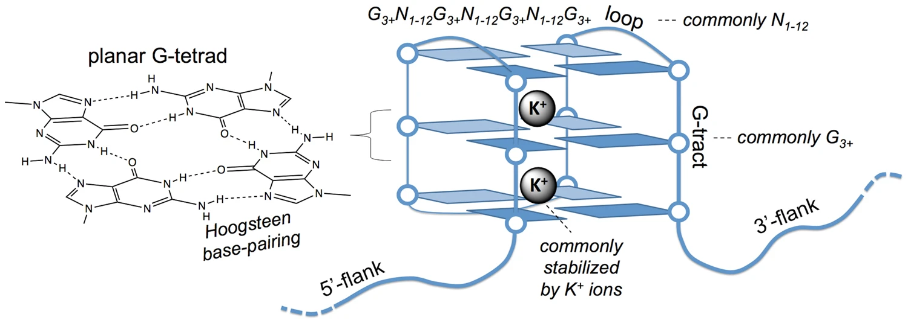
```
]
.pull-right[.small[_Balasubramanian et al,Sci Rep, 2017_]]


* .large[Fold into four-stranded structures.]
* .large[Containing guanine tetrad.]
* .large[Motif] $G\geq3N_xG\geq3N_yG\geq3N_zG\geq3$


---
## Biological function of G4's

.center[
```{r out.width = '70%',echo=F}
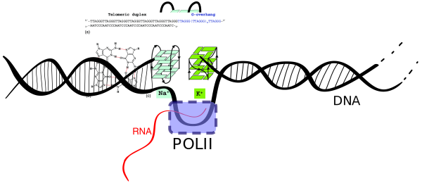
```
]
.large[
* Regulation of __gene expression__ and __chromatin architecture__.
* __Telomere stability__.
* Disrupting the replication fork progression causing __Double-strand breaks (DSBs)__.
]


---
## Algorithms for G-quadruplexes (G4) predictions
### Expert system methods

```{r,echo=F}
G4.table <- tibble(
  "Name" = c("DeepG4",
"penguinn_retrained",
"penguinn",
"G4detector_retrained",
"G4detector",
"quadron_retrained",
"quadron_score",
"G4hunterRF",
"G4hunter",

"qparse",
"pqsfinder",
"gqrs_mapper",
"quadparser",
"G4CatchAll"),
"Method"=c(rep("Deep Learning",5),rep("Machine Learning",3),rep("Score based",4),rep("Regex",2)),
"Implementation" = c("R/Tensorflow",rep("Python / Tensorflow",4),rep("R xgboost",2),"R ranger / python",rep("Python",2),"R",rep("Python",2),"Python")
)

sub.G4.table <- G4.table%>%
  filter(Name %in% c("G4hunter",
"qparse",
"pqsfinder",
"gqrs_mapper",
"quadparser",
"G4CatchAll")) %>% 
  mutate(Year = c(2016,2019,2017,2006,2005,2019)) %>%
  mutate(Link = c("https://github.com/AnimaTardeb/G4Hunter","https://github.com/B3rse/qparse","https://bioconductor.org/packages/release/bioc/html/pqsfinder.html","http://bioinformatics.ramapo.edu/QGRS","https://github.com/dariober/","https://github.com/odoluca/G4Catchall")) 
sub.G4.table%>% 
  mutate(Link = cell_spec(Link,link=sub.G4.table$Link)) %>% 
  arrange(Year) %>% 
  mutate(Method = cell_spec(Method, align = "c",background =factor(Method,unique(G4.table$Method),RColorBrewer::brewer.pal(length(unique(G4.table$Method)), "Spectral")))) %>%
  mutate(Name = cell_spec(Name, align = "c",background ="black",color = "white",bold=T)) %>% 
  mutate(Implementation = cell_spec(Implementation, align = "c",color = "black",bold=T)) %>% 
  kable(escape=F) %>%
  kable_styling(bootstrap_options = "striped", full_width = T, font_size = 16
                )

```

* __Regex: __ `([Gg]{3,})  (\w{1,8})  ([Gg]{3,}) (\w{1,8}) ([Gg]{3,}) (\w{1,8}) ([Gg]{3,})`
* __Score based:__ Compute a score using a sliding windows over the whole genome by using __G richness__ and __G skewness__ (G4Hunter).


---
class: split-40

### First G4 genome-wide mapping _in vitro_ (G4-seq) 2014 

.column[

.large[[High-throughput sequencing of DNA G-quadruplex structures in the human genome](https://www.nature.com/articles/nbt.3295)]

* High-resolution sequencing–based method to detect G4s in the human genome in vitro.

* The developed method called G4-seq combining features of the polymerase stop assay with Illumina next-generation sequencing.


]
.column[

```{r out.width = '60%',echo=F}
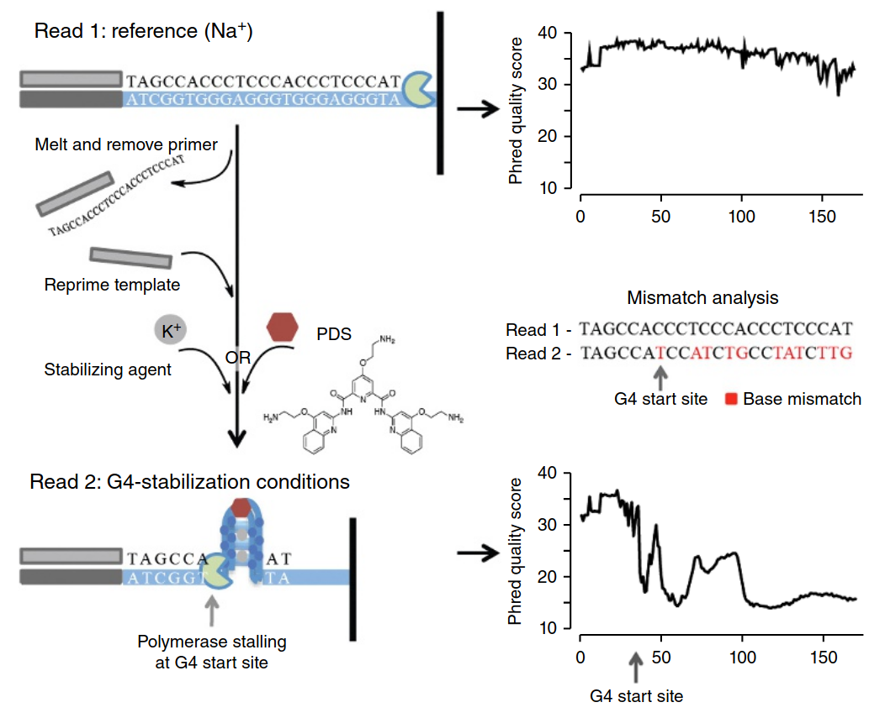
```

]


---
## Algorithms for G-quadruplexes (G4) predictions
### Machine learning based algorithms

```{r,echo=F}
sub.G4.table <- 
  tibble(Name = c("quadron","G4detector","penguinn")) %>%
  mutate(Method = c("Machine Learning",rep("Deep Learning",2))) %>% 
  mutate(Implementation = c(rep("R xgboost",1),rep("Python / Tensorflow",2))) %>% 
  mutate(Year = c(2017,2019,2020)) %>%
  mutate(Link = c("https://github.com/aleksahak/Quadronr","https://github.com/OrensteinLab/G4detector","https://github.com/ML-Bioinfo-CEITEC/penguinn")) 
sub.G4.table%>% 
  mutate(Link = cell_spec(Link,link=sub.G4.table$Link)) %>% 
  arrange(Year) %>% 
  mutate(Method = cell_spec(Method, align = "c",background =factor(Method,unique(G4.table$Method),RColorBrewer::brewer.pal(length(unique(G4.table$Method)), "Spectral")))) %>%
  mutate(Name = cell_spec(Name, align = "c",background ="black",color = "white",bold=T)) %>% 
  mutate(Implementation = cell_spec(Implementation, align = "c",color = "black",bold=T)) %>% 
  kable(escape=F) %>%
  kable_styling(bootstrap_options = "striped", full_width = T, font_size = 18
                )

```

* __Quadron:__ A machine learning model to predict the formation of G4s using 119  sequence-based features. I.e: the number of tetrads in the G4s , the occurrence of special kmer … 
* __Penguinn, G4detector:__ Multiple layers CNN (Deep learning)


---
class: split-80

### Mapping G4s in vivo with __BG4-seq__ (2018)


.column[

* ChIP-seq for the DNA secondary structures through the use of a G4-structure-specific single-chain antibody (BG4).
* Refinements in chromatin immunoprecipitation.
* Followed by high-throughput sequencing.

```{r out.width = '100%',echo=F}
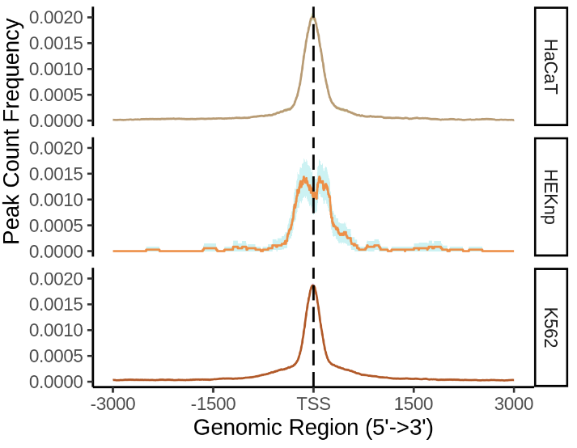
```
]
.column[

[Genome-wide mapping of endogenous G-quadruplex DNA structures by chromatin immunoprecipitation and high-throughput sequencing](https://www.nature.com/articles/nprot.2017.150)


```{r out.width = '70%',echo=F}
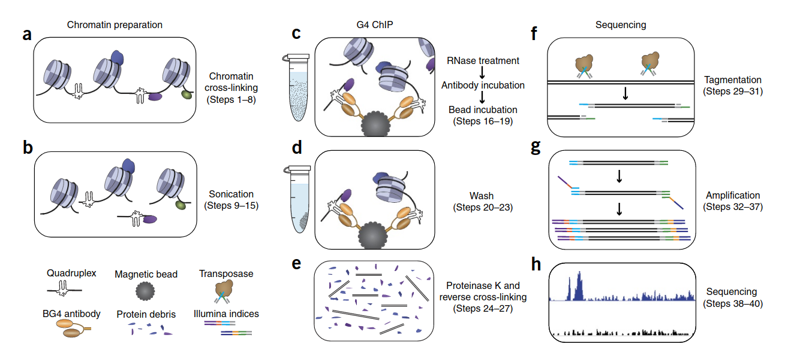
```


]


---

## __Active G4s__ dataset
.pull-left[

#### Overlap between in vitro (G4-Seq) and in vivo (BG4-Seq) form active G4s.
```{r out.width = '100%',echo=F}
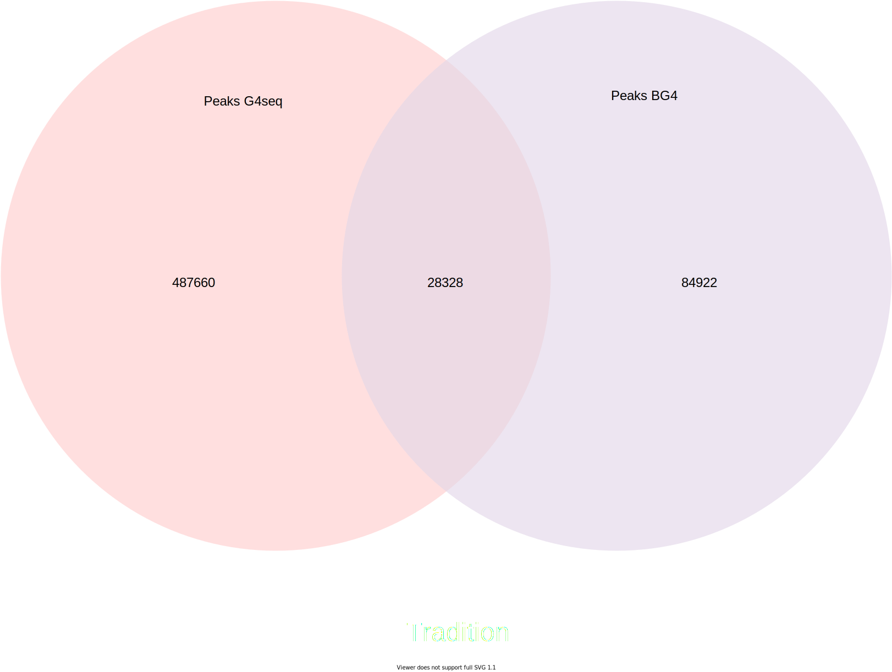
```

]

.pull-right[

```{r out.width = '50%',echo=F}
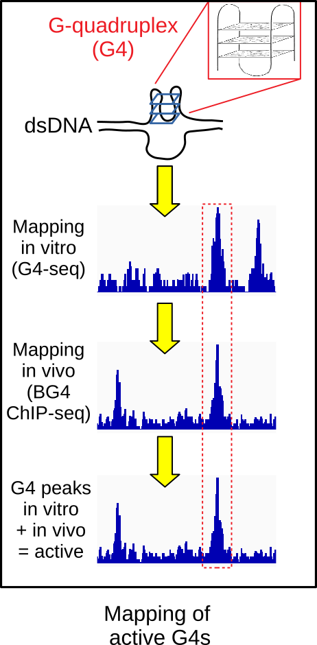
```

]


---


## G4 predictions with __DeepG4__

#### __DeepG4__: a deep learning model to predict __active G4s__ (BG4-G4-seq peaks).

.pull-left[
#### What is deep learning ? 
```{r out.width = '80%',echo=F}
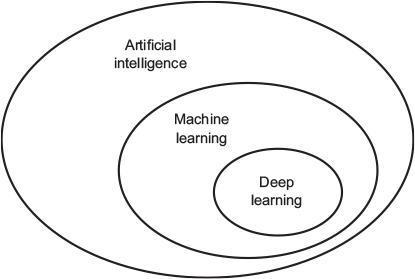
```


]

.pull-right[
#### Some basic representation of a multi-layer deep learning model
```{r out.width = '100%',echo=F}
knitr::include_graphics("imgs/deeplearning_img1.png")
```

]


---
## G4 predictions with __DeepG4__

#### Deep learning for DNA sequences.

.pull-left[

```{r out.width = '95%',echo=F}
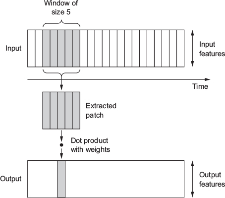
```

#### Convolutional model (CNN)

]

.pull-right[


```{r out.width = '100%',echo=F}
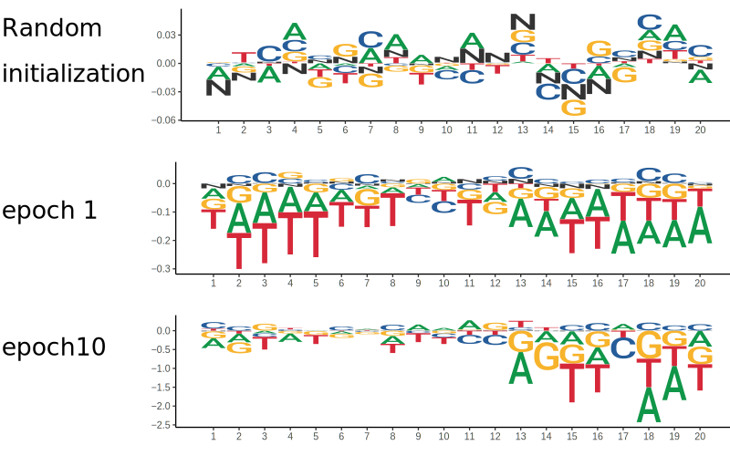
```
#### Weights can be represented as PWM and encode motifs as features for our model.

]


---
## __DeepG4__ model architecture

```{r out.width = '100%',echo=F}
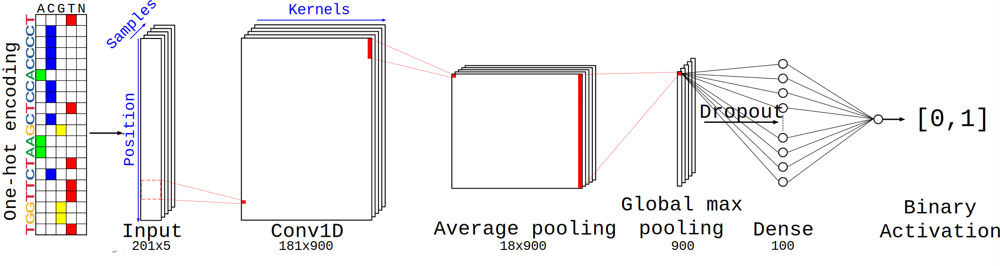
```

1. __Conv1D__: Scan sequences using kernel (20bp).
2. __Average pooling__: Reduce dimension size and aggregate kernel signal.
3. __Global max pooling__: Output max activation signal for each kernel.
4. __Dropout__: Regularization layer.
5. __Dense layer__ `(100 units,linear)`: Combination of weighted kernel signal.
6. __Dense layer__ `(1 unit, sigmoid)`: Output a probability.


---
class: split-40
## __DeepG4__: Performances


.column[

#### Input

__Control sequences:__ randomly selected genomic sequences that matched sizes, GC,
and repeat contents similar to actives G4s (R package gkmSVM).

* __HaCat G4:__ train/validation/test dataset.
* __Independent experiment:__ HaCat, HEKnp, K562.


]
.column[

#### Tools

```{r,echo=F}

G4.table %>%  mutate(Method = cell_spec(Method, align = "c",background =factor(Method,unique(G4.table$Method),RColorBrewer::brewer.pal(length(unique(G4.table$Method)), "Spectral")))) %>%
  mutate(Name = cell_spec(Name, align = "c",background ="black",color = "white",bold=T)) %>% 
  mutate(Implementation = cell_spec(Implementation, align = "c",color = "black",bold=T)) %>% 
  kable(caption = "G4 detection algorithms",escape=F) %>%
  kable_styling(bootstrap_options = "striped", full_width = F, font_size = 16
                , position = "float_right"
                )


```

]


---

## __DeepG4__: Performances

```{r out.width = '100%',echo=F}
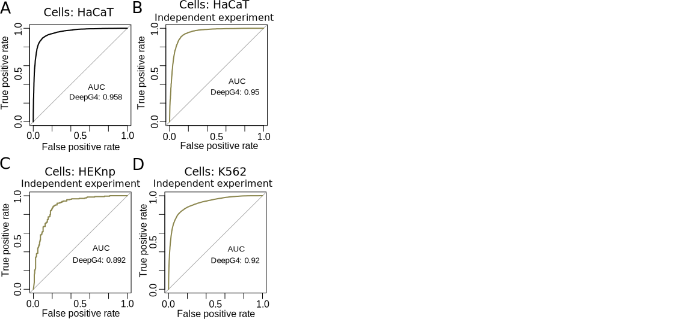
```


---

## __DeepG4__: Performances

```{r out.width = '100%',echo=F}
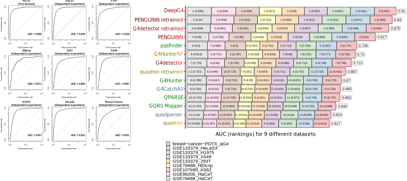
```


---

## __DeepG4__: Feature extraction

* __Motifs are extracted from kernels__.
* 900 kernels associated into __163 clusters__ using matrix clustering (RSAT).
* Represented into __163 root motifs__.

.center[
```{r out.width = '70%',echo=F}
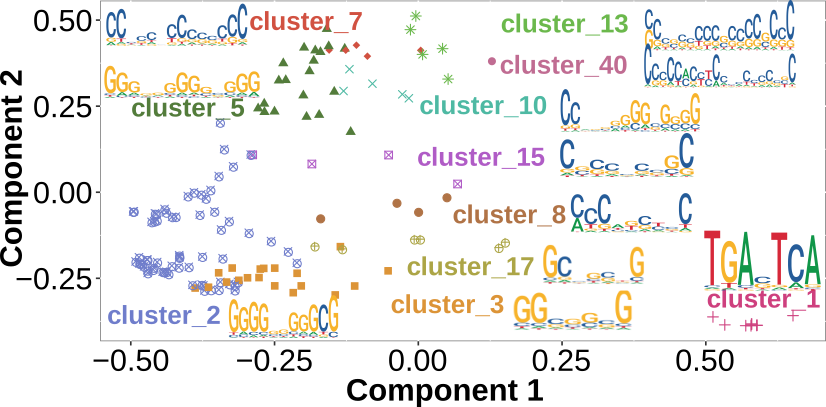
```

#### Multidimensional scaling (MDS) of DeepG4 clusters.
]


---
class: split-40-reverse
## __DeepG4__: Feature importance


.column[

* Known TFBS motifs (identified with TomTom) are good predictors.
* De novo and G4-like motifs also found as good predictors.


.pull-left[

```{r out.width = '100%',echo=F}
knitr::include_graphics("imgs/enrichissement_Cluster.svg")
```

]

.pull-right[

```{r out.width = '100%',echo=F}
knitr::include_graphics("imgs/impluster_motif.svg")
```

]

]

.column[


```{r out.width = '30%',echo=F}
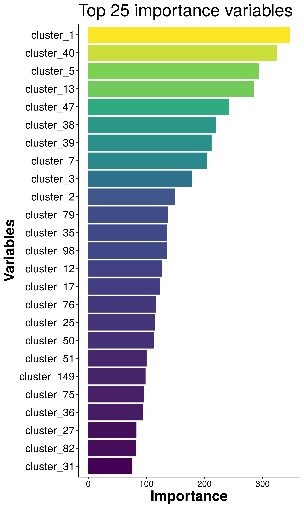
```

]


---
### Cell type specific transcription factor motif predictors of active G4s

.center[
```{r out.width = '80%',echo=F}
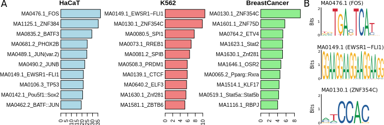
```
]

__Random Forest classifier:__

* One cell type vs all others cells types.
* Use TFBS motifs as features.
* Importance weighted by motif abundance in the positive set.


---
class: split-40-reverse
## __DeepG4__: SNP effect on active G4s


```{r out.width = '90%',echo=F}
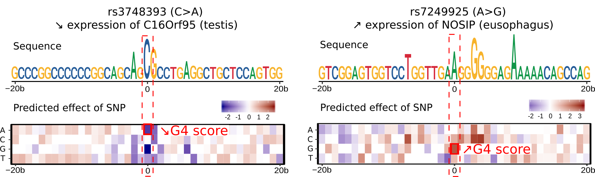
```

.column[
* C>A lead to a decrease in G4 activity.
* A>G lead to an increase in G4 activity.

__SNPs could alter the G4 structure stability.__

.large[SNPs eQTL (GTEx) increasing gene expression presented high G4 activity.]

]

.column[


```{r out.width = '30%',echo=F}
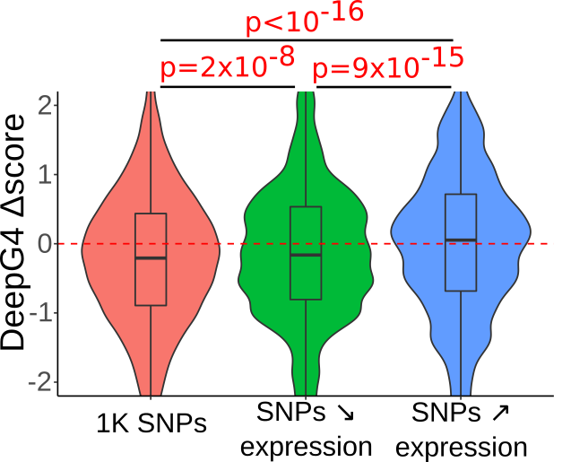
```

]


---
class: inverse, center, middle

### .right[.Large[Thanks __!__]]

<hr />

.large[Vincent ROCHER, Matthieu Genais, Elissar Nassereddine and Raphaël Mourad]

.large[CBI-Toulouse | Chromatin and DNA Repair | 23/11/2020]

---

## Possible upgrades

.Large[

* Quasi-SVM as last layer (replacing Dense).
* Filled weights with JASPAR PWMs to help training.
* Parallel convolution layer with differents kernels sizes.
* Add DNA accessibility as input with ATAC-seq.

]
---

## Sequence features enriched at active G4s
.pull-left[

* Active G4s are enriched in __promoters__.
* Current algorithms failed to predict non-negligible fraction of __active G4s (11%)__.
* And more than 50% of their results are __false positives__.

]

.pull-right[

```{r out.width = '42%',echo=F}
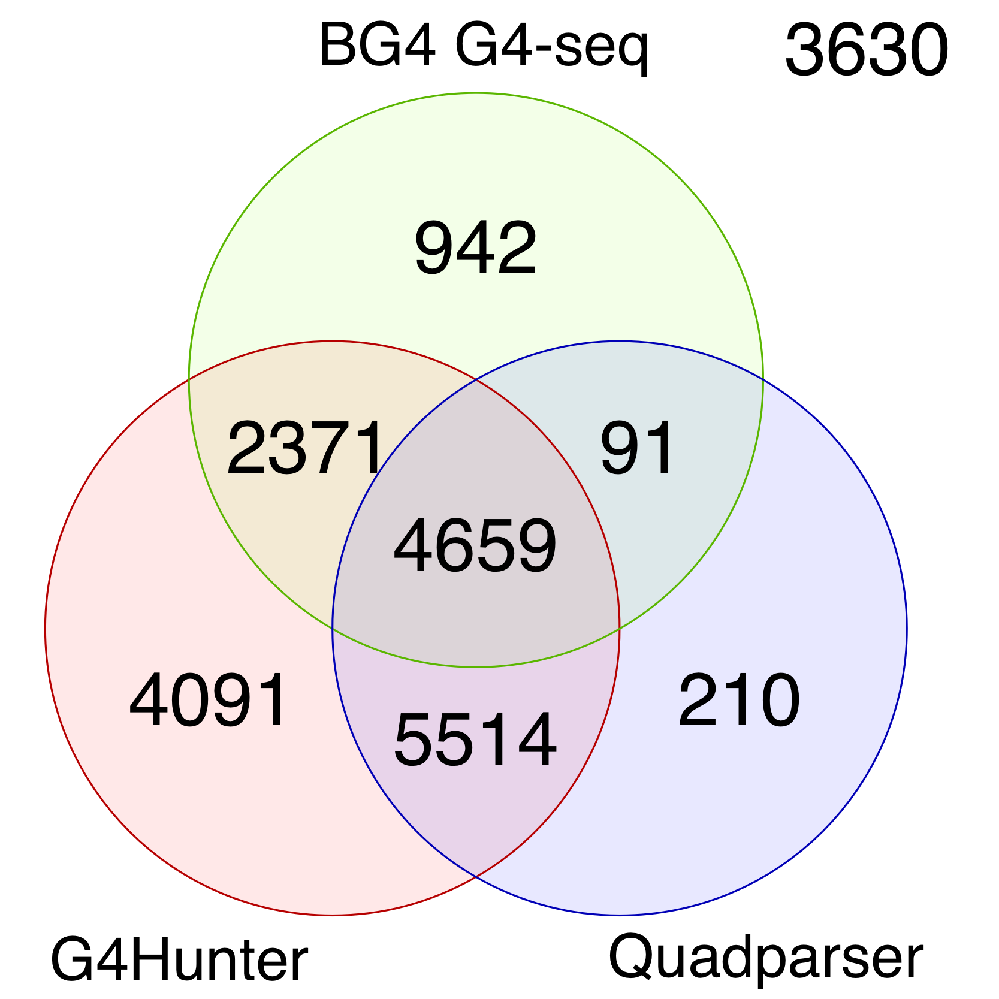
```

]
.center[
```{r out.width = '85%',echo=F}
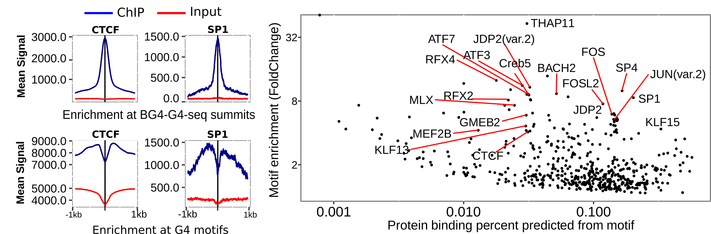
```
]
---
.center[
```{r out.width = '80%',echo=F}
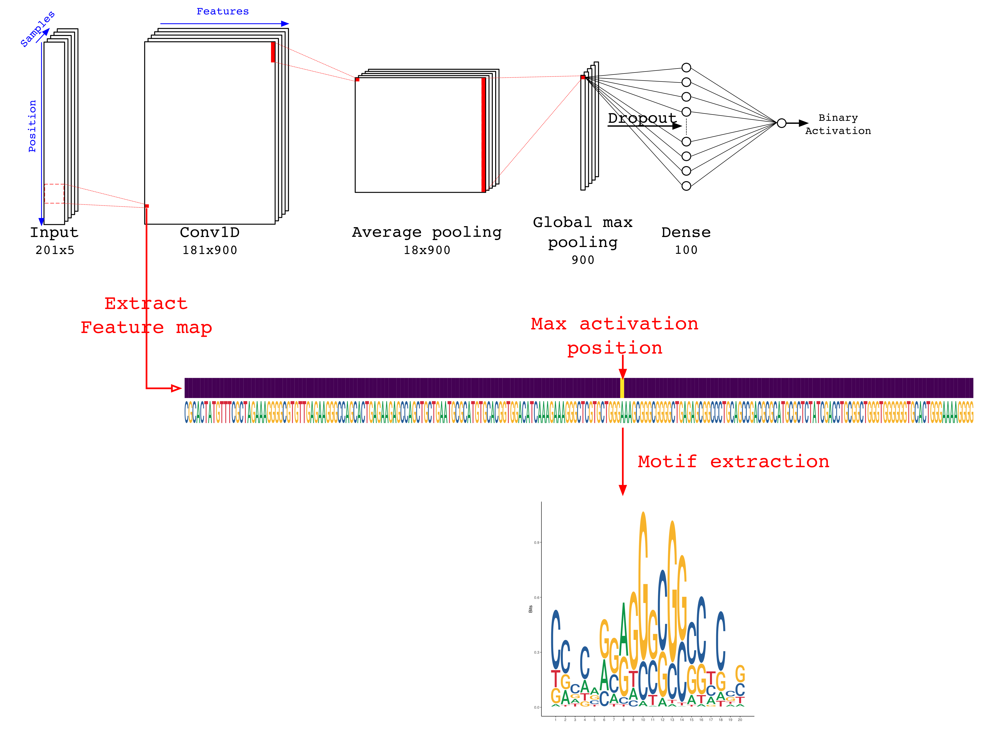
```
]
---
## __AUC__

```{r,echo=F,warning=F,message=F}
library(formattable)
fres <- read_tsv("recap_AUC_1.tsv") %>% 
  gather(key = Input,value=AUC,-Tool) 
fres <- fres %>% 
  mutate(AUC = color_bar("lightgreen")(fres$AUC)) %>% 
  spread(key = Tool,value = AUC) %>% 
  mutate(Input = str_remove(Input,"_Ctrl_gkmSVM|_Ctrl"))
fres %>% 
  kable(escape=F) %>%
  kable_paper("hover", full_width = F) %>% 
  column_spec(1:ncol(fres), width = "3cm") %>%
  scroll_box(height = "500px")
#xaringan::decktape("index.html","index.pdf")
#pagedown::chrome_print("index.html")
```