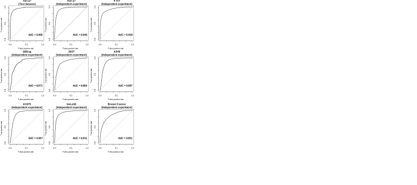

---
output:
  xaringan::moon_reader:
    seal: false
    css: [default,rutgers,metropolis-fonts,custom.css]
    lib_dir: libs
    nature:
      highlightStyle: googlecode
      highlightLines: true
      highlightSpans: true
      countIncrementalSlides: false
      ratio: '16:9'
    
---


```{r setup, include=FALSE}
require(knitr)
require(kableExtra)
require(tidyverse)
options(kableExtra.latex.load_packages = FALSE)
options(knitr.table.format = "html")
```

class: inverse, center, middle
background-image: url(imgs/logo.svg),url(imgs/cbi.png),url(imgs/logo_UT3_RVB.png),url(imgs/index.jpeg)
background-position: 50% 0%,25% 100%,50% 100%,75% 100%
background-size: 45%,15%,20%,10%


## .center[.large[Deep__G4:__] A deep learning approach to predict active G-quadruplexes]

### .center[SeqBim 2020]
<hr />

.large[Vincent ROCHER, Matthieu Genais, Elissar Nassereddine and Raphaël Mourad]

.large[CBI-Toulouse | Chromatin and DNA Repair | 23/11/2020]


???

Bonjour à tous, je m'appelle Vincent ROCHER, je suis en thèse au centre de biologie intégrative à toulouse, dans l'équipe de Gaëlle LEGUBE, Chromatin and DNA repair.
Durant cette présentation je vais vous présenter un projet sur lequelle je travaille avec mon directeur de thèse de thèse Raphael Mourad, Matthieu Genais, qui est maintenant en thèse chez Bruno Ségui et Vera pancaldi au CRCT, et Elissar Nasseredidine qui est en apprentissage en bioinfo chez nous.

Donc ce projet avait pour objectif de déveloper un outil, DeepG4, une approche deep learning pour prédire les G-quadruplexes actifs, en utilisant uniquement la séquence ADN.


Hello everyone, my name is Vincent ROCHER, I'm a phd student at the Center for Integrative Biology in Toulouse, Gaëlle LEGUBE's lab, Chromatin and DNA repair.
During this presentation I will present a project on which I am working with my thesis director Raphael Mourad, Matthieu Genais, who is now phd student with Bruno Ségui and Vera pancaldi at the CRCT, and Elissar Nasseredidine who is doing an apprenticeship in bioinfo with us .

So this project aimed to develop a tool, DeepG4, who is a deep learning approach to predict active G-quadruplexes, using only the DNA sequence as input.

---

## __DNA__: The secret of life 

.pull-left[
.large[
### __B-DNA__ _(1953)_
]
```{r out.width = '40%',echo=F}
knitr::include_graphics("imgs/DNA.png")
```

> The B- DNA (double helix structure) is the most stable structure.

]

.pull-right[
.large[
### __Non B-DNA__ _(1954)_
]
```{r out.width = '90%',echo=F}
knitr::include_graphics("imgs/nonBDNA.png")
```

]

???

Alors les G quadruplexe, ou G4, sont des structures secondaires de l'ADN. Donc on connait tous la structure classique de l'ADN en double hélice, decouverte en 1953. mais il faut aussi savoir que l'ADN peut etre présent sous d'autres formes, que j'ai représenté ici, dont le G4

So the G-quadruplexes, or G4, are DNA secondary structures. So we all know the classic double helix DNA structure, discovered in 1953. But you should also know that DNA can be present in other forms, which I have represented here, including G4

---

## __G-Quadruplex (G4)__: A non B-DNA Structure
.center[
```{r out.width = '80%',echo=F}
knitr::include_graphics("imgs/41598_2017_14017_Fig1_HTML.webp")
```
]
.pull-right[.small[_Balasubramanian et al,Sci Rep, 2017_]]


* .large[Fold into four-stranded structures.]
* .large[Containing guanine tetrad.]
* .large[Motif] $G\geq3N_xG\geq3N_yG\geq3N_zG\geq3$

???

Donc les G4 sont des structures particulières de l'ADN, formés à partir de quatre brins qui se replient. Cette structure se forme à partir d'un simple brin, donc on perd la structure double-brin de l'ADN, et ce simple brin va s'associer avec lui même, 4 fois donc via un enchainement de 4 résidus de guanine qu'on appelle un quartet. Donc c'est une structure très particulière qui laisse l'autre brin libre.


So G4s are special structures in DNA, built from four strands that fold together. This structure is formed from a single strand, so we lose the DNA double-stranded structure, and this single strand will associate with itself, 4 times using a sequence of 4 guanine residues that we call a quartet. So it's a very particular structure that leaves the other end free.

---
## Biological function of G4's

.center[
```{r out.width = '70%',echo=F}
knitr::include_graphics("imgs/G4.svg")
```
]
.large[
* Regulation of __gene expression__ and __chromatin architecture__.
* __Telomere stability__.
* Disrupting the replication fork progression causing __Double-strand breaks (DSBs)__.
]

???

Du fait de sa structure particulière, le G4 va avoir de nombreux rôles, donc dans les télomères là ou i lest enrichi, qui est une région riche en G, mais aussi, et plus intéréssant pour nous, le G4 est retrouvé enrichi au niveau des promoteurs, et va avoir un rôle dans l'expression du gène associé. Par exemple ici on a création d'une R-loop sur le brin opposé au G4, ce qui favorise la transcription, mais on peut aussi avoir le G4 qui se forme sur un motif d'un facteur de transcription et empecher l'expression d'un gène. La présence d'un G4 sur une séquence peut avoir des conséquences assez grave notamment en causant des dommages à l'ADN quand la fourche de replication entre en contact avec un G4, ce qui peut a terme causer des DSBs donc cassures double brin qui peuvent être très deletères 

Due to its particular structure, the G4 will have many roles, therefore in the telomeres where it is enriched, but also, and more interesting for us, the G4 is found enriched at promoters, and have a role in the expression of the associated gene. For example here we have an R-loop on the opposite strand, which promotes transcription, but we can also have G4 which forms directly on a motif of a transcription factor and could prevent the expression of a gene. The presence of a G4 in a sequence can have serious consequences, in particular by causing damage to the DNA when the replication fork comes into contact with a G4, which can eventually cause double strand breaks (DSBs) that can to be very deleterious for the cells.

---
## Algorithms for G-quadruplexes (G4) predictions
### Expert system methods

```{r,echo=F}
G4.table <- tibble(
  "Name" = c("DeepG4",
"penguinn_retrained",
"penguinn",
"G4detector_retrained",
"G4detector",
"quadron_retrained",
"quadron_score",
"G4hunterRF",
"G4hunter",

"qparse",
"pqsfinder",
"gqrs_mapper",
"quadparser",
"G4CatchAll"),
"Method"=c(rep("Deep Learning",5),rep("Machine Learning",3),rep("Score based",4),rep("Regex",2)),
"Implementation" = c("R/Tensorflow",rep("Python / Tensorflow",4),rep("R xgboost",2),"R ranger / python",rep("Python",2),"R",rep("Python",2),"Python")
)

sub.G4.table <- G4.table%>%
  filter(Name %in% c("G4hunter",
"qparse",
"pqsfinder",
"gqrs_mapper",
"quadparser",
"G4CatchAll")) %>% 
  mutate(Year = c(2016,2019,2017,2006,2005,2019)) %>%
  mutate(Link = c("https://github.com/AnimaTardeb/G4Hunter","https://github.com/B3rse/qparse","https://bioconductor.org/packages/release/bioc/html/pqsfinder.html","http://bioinformatics.ramapo.edu/QGRS","https://github.com/dariober/","https://github.com/odoluca/G4Catchall")) 
sub.G4.table%>% 
  mutate(Link = cell_spec(Link,link=sub.G4.table$Link)) %>% 
  arrange(Year) %>% 
  mutate(Method = cell_spec(Method, align = "c",background =factor(Method,unique(G4.table$Method),RColorBrewer::brewer.pal(length(unique(G4.table$Method)), "Spectral")))) %>%
  mutate(Name = cell_spec(Name, align = "c",background ="black",color = "white",bold=T)) %>% 
  mutate(Implementation = cell_spec(Implementation, align = "c",color = "black",bold=T)) %>% 
  kable(escape=F) %>%
  kable_styling(bootstrap_options = "striped", full_width = T, font_size = 16
                )

```

* __Regex: __ `([Gg]{3,})  (\w{1,8})  ([Gg]{3,}) (\w{1,8}) ([Gg]{3,}) (\w{1,8}) ([Gg]{3,})`
* __Score based:__ Compute a score using a sliding windows over the whole genome by using __G richness__ and __G skewness__ (G4Hunter).

???

Il existe déjà beaucoup d'algorithmes qui permettent de prédire les G4 sur une séquence d'ADN donné en input. Un grand nombre d'entre eux sont basés sur des connaissances en biophysique du filament d'ADN, donc c'est un système expert et les plus simples d'entres eux sont simplement une expression régulière pour quadparser par exemple, et pour d'autre un système de score basé sur la richesse en G d'une séquence, qui va traduire la propension de cette séquence a former un G4. Donc ici on utilise les connaissance en biophysique pour construire un outil qui va prédire les G4.

There are already many algorithms that can predict G4s on a DNA sequence given as input. Many of them are based on knowledge in biophysics, with the DNA filament, so it's an expert system and the most simple of them are just a regular expression, for example quadparser. Others tools use a scoring system based on the G-richness inside a sequence, which will reflect the propensity of this sequence to form a G4. So here we use knowledge in biophysics to build a tool that will predict G4.

---
class: split-40

### First G4 genome-wide mapping _in vitro_ (G4-seq) 2014 

.column[

.large[[High-throughput sequencing of DNA G-quadruplex structures in the human genome](https://www.nature.com/articles/nbt.3295)]

* High-resolution sequencing–based method to detect G4s in the human genome in vitro.

* The developed method called G4-seq combining features of the polymerase stop assay with Illumina next-generation sequencing.


]
.column[

```{r out.width = '60%',echo=F}

```

]

???

En 2014 cependant une équipe a trouvé un autre moyen d'identifier les G4 sur le génome, de façon experimentale cette fois via une méthode de séquençage à haut débit qui s'appelle le G4. Cette méthode a la particularité de mapper les G4 mais in-vitro. Donc ici on a la chapacité physique de l'ADN a former ou non un G4. Ce n'est pas basé sur un anticorps mais plutot sur le taux de mismatch qu'on observe sur une séquence suite à la stabilisation du G4. Plus on stabilise longtemps un G4, plus on aura du mal à séquencer, ce qui va produire des erreurs. C'est donc un taux de mismatch que le G4-seq quantifie directement, avant et après stabilisation du G4.

In 2014, however, a team found another way to identify G4s on the genome, in an experimental way using a next-generation sequencing method called G4-seq. This method can map the G4 but in-vitro. So here we have the physical capacity of the DNA to form or not a G4. It is not based on an antibody but rather on the rate of mutation that we observe on a sequence following the stabilization of G4. The longer a G4 is stabilized, the more the effect of the polymerase will be affected and will have difficulty in sequencing, which will produce errors. It is therefore a mutation rate that G4-seq directly quantifies, before and after stabilization of G4.

---
## Algorithms for G-quadruplexes (G4) predictions
### Machine learning based algorithms

```{r,echo=F}
sub.G4.table <- 
  tibble(Name = c("quadron","G4detector","penguinn")) %>%
  mutate(Method = c("Machine Learning",rep("Deep Learning",2))) %>% 
  mutate(Implementation = c(rep("R xgboost",1),rep("Python / Tensorflow",2))) %>% 
  mutate(Year = c(2017,2019,2020)) %>%
  mutate(Link = c("https://github.com/aleksahak/Quadronr","https://github.com/OrensteinLab/G4detector","https://github.com/ML-Bioinfo-CEITEC/penguinn")) 
sub.G4.table%>% 
  mutate(Link = cell_spec(Link,link=sub.G4.table$Link)) %>% 
  arrange(Year) %>% 
  mutate(Method = cell_spec(Method, align = "c",background =factor(Method,unique(G4.table$Method),RColorBrewer::brewer.pal(length(unique(G4.table$Method)), "Spectral")))) %>%
  mutate(Name = cell_spec(Name, align = "c",background ="black",color = "white",bold=T)) %>% 
  mutate(Implementation = cell_spec(Implementation, align = "c",color = "black",bold=T)) %>% 
  kable(escape=F) %>%
  kable_styling(bootstrap_options = "striped", full_width = T, font_size = 18
                )

```

* __Quadron:__ A machine learning model to predict the formation of G4s using 119  sequence-based features. I.e: the number of tetrads in the G4s , the occurrence of special kmer … 
* __Penguinn, G4detector:__ Multiple layers CNN (Deep learning)

???

Maintenant qu'on a des données pour prédire les G4, des métodes de machine learning vont donc pouvoir être appliquée sur ces données pour prédire un G4 directement à partir d'une séquence. Sauf que cette fois les paramètres ne sont plus basés sur les connaissances expertes en biophysique de l'ADN, mais directement sur des données experimentales.
Ici j'ai listé quelques outils qui utilisent le G4-seq en input pour apprendre les paramètres. On a quadron qui est une méthode de machine learning qui va utiliser 119 features basé sur la composition de la séquence, richesse en G, présence de k-mers ect ... et deux autres qui sont des méthodes de deep learning, qui on le verra juste après vont construire eux même leurs features sans intervention humaine. 

Now that we have data to predict G4s, machine learning methods can be applied to this to predict G4 directly from a sequence. Except this time the parameters are no longer based on expert knowledge in DNA biophysics, but directly on experimental data.
Here I have listed some tools that use G4-seq as input to learn parameters. We have quadron which is a machine learning method which will use 119 features based on the composition of the sequence, like the  G-richness, presence of k-mers ect ... and two others which are deep learning methods, and we will see just after that they will build their own features without human intervention.

---
class: split-80

### Mapping G4s in vivo with __BG4-seq__ (2018)


.column[

* ChIP-seq for the DNA secondary structures through the use of a G4-structure-specific single-chain antibody (BG4).
* Refinements in chromatin immunoprecipitation.
* Followed by high-throughput sequencing.

```{r out.width = '100%',echo=F}
knitr::include_graphics("imgs/Av_prof.png")
```
]
.column[

[Genome-wide mapping of endogenous G-quadruplex DNA structures by chromatin immunoprecipitation and high-throughput sequencing](https://www.nature.com/articles/nprot.2017.150)


```{r out.width = '70%',echo=F}
knitr::include_graphics("imgs/BG4seq.png")
```


]

???

Cependant ces données sont basés sur la présence de G4 in-vitro, ce qui ne nous donne pas d'info sur la capacité réelle de la séquence a former un G4 in-vivo. On arrive donc en 2018 ou le premier mapping de G4 in vivo a eu lieu. cette méthode est basé sur le ChIP-seq puisqu'elle utilise un anticorps au G4, le BG4, pour capturer les séquences d'ADN qui forment une structure G4 in vivo. et Donc nous c'est plutot ces données là qui vont nous intérésser. Si on trace le profil moyen des gènes sur ces données de BG4-seq on voit bien que le signal est fort au niveau de la region promotrice des gènes.

However, these data are based on the presence of G4 in-vitro, which does not give us any information on the actual capacity of the sequence to form a G4 in-vivo. So we arrive in 2018 for the first mapping of G4 in vivo. This method is based on ChIP-seq since it uses an antibody to G4, BG4, to capture the DNA sequences which form a G4 structure in vivo. And this is this kind of data that will interest us. If we plot the average profile for the genes on these BG4-seq data, we can clearly see that the signal is strong at the promoter region of the genes.

---

## __Active G4s__ dataset
.pull-left[

#### Overlap between in vitro (G4-Seq) and in vivo (BG4-Seq) form active G4s.
```{r out.width = '100%',echo=F}

```

]

.pull-right[

```{r out.width = '50%',echo=F}
knitr::include_graphics("imgs/mergepeaks.png")
```

]

???

Dans notre étude, nous avons voulus nous concentrer sur les G4 actifs, c’est-à-dire les pics qui sont à l’intersection entre l’experience in vitro et l’experience in vivo. De cette façon, nous faisons le lien entre la capacité physique de l’ADN à former un G4 (via in vitro) et un signal détecté in vivo, et nous évitons les faux positifs que nous aurions pû avoir si nous avions pris l’ensemble des pics in vivo. C’est donc ce jeu de données qu’on va utiliser pour prédire ce qu’on va appeler les G4 actifs.


In our study, we wanted to focus on active G4s, meaning the peaks that are at the intersection between the in vitro experimentation and the in vivo experimentation. This way, we make the link between the DNA physical ability to form a G4 (via in vitro) and a signal detected in vivo, and we avoid the false positives that we could have if we had taken the whole peaks in vivo. So this is the dataset that we're going to use to predict what we'll call the active G4s.

---


## G4 predictions with __DeepG4__

#### __DeepG4__: a deep learning model to predict __active G4s__ (BG4-G4-seq peaks).

.pull-left[
#### What is deep learning ? 
```{r out.width = '80%',echo=F}
knitr::include_graphics("imgs/whatisdeeplearning.jpg")
```


]

.pull-right[
#### Some basic representation of a multi-layer deep learning model
```{r out.width = '100%',echo=F}
knitr::include_graphics("imgs/deeplearning_img1.png")
```

]

???

Donc pourquoi partir sur du deep learning ? Et bien déjà rapidement, on peut définir le deep learning comme une sous branche du machine learning. On l’appelle “Deep” car il consiste en un empilement de fonctions mathématiques qui vont opérer une transformation non linéaire successive des données, pour obtenir une prédiction. En plus de ça le deep learning utilise les données “brutes”, par exemple une image, et apprend lui même les features directement des données, à la différence du machine learning classique qui nécessite une expertise humaine pour extraire les features importantes des données.

So why using deep learning? Well, we can define deep learning as a sub-branch of machine learning. We call it “Deep” because it consists of a stack of mathematical functions that will operate a successive nonlinear transformation of the data, to obtain a prediction. In addition to that, deep learning uses “raw” data, for example an image, and itself learns the features directly from the data, unlike classic machine learning which requires human expertise to extract the important features from the data.

---
## G4 predictions with __DeepG4__

#### Deep learning for DNA sequences.

.pull-left[

```{r out.width = '95%',echo=F}

```

#### Convolutional model (CNN)

]

.pull-right[


```{r out.width = '100%',echo=F}
knitr::include_graphics("imgs/kernel464_pwm_epoch0to20.svg")
```
#### Weights can be represented as PWM and encode motifs as features for our model.

]

???

Alors il existe déjà pas mal d’utilisation du deep learning qui utilise les séquences de l’ADN, pour différentes questions, et plusieurs types de modèles peuvent être utilisés. Nous on a décidé de partir sur le modèle convolutif 1D ou CNN, représenté ici, qui est particulièrement bien adapté aux séquences d’ADN :
Ce qu’il fait c’est qu’il va scanner la séquence via une fenêtre glissante, et par produit scalaire avec des poids va produire une response map, qui nous dira si une feature est présente dans notre séquence, à quelle intensité et à quelle position.

Alors ici les features, ou kernels, sont représentables comme des motifs pondérés dans le cas de l’ADN. Alors ici par exemple on a un kernel, représenté comme une PWM. À l’initialisation, le kernel est déterminé de façon aléatoire, ça se voit bien ici. Et au fur et à mesure que le modèle va apprendre des données,le kernel va converger vers un motif pondéré spécifique, et sa response map va nous indiquer la présence de ce motif, dans la séquence. Et ce qui est intéressant ici, c’est que le modèle détermine lui même les motifs intéréssant, et on a pas besoin d’utiliser de base de données, on peut donc faire du de novo.

So there is already quite a lot of deep learning modeles that uses DNA sequences, for different questions, and several types of models can be used. We decided to start with the 1D convolutional model or CNN, which is particularly well to DNA sequences:
What it does is that it will scan the sequence using a sliding window, and by dot product with weights will produce a response map, which will tell us if a feature is present in our sequence, at at what intensity and at which position.

So here the features, or kernels, can be represented as weighted patterns in the case of DNA. So here for example we have a kernel, represented as a PWM. At initialization, the kernel is determined randomly, it can be seen here. And as the model learns from the data, the kernel will converge to a specific weighted pattern, and its response map will tell us the presence of that pattern, in the sequence. And what's interesting here is that the model itself determines the interesting patterns, and you don't need to use a database, so you can do de novo analysis.

---
## __DeepG4__ model architecture

```{r out.width = '100%',echo=F}
knitr::include_graphics("imgs/CNN_model_improved.svg")
```

1. __Conv1D__: Scan sequences using kernel (20bp).
2. __Average pooling__: Reduce dimension size and aggregate kernel signal.
3. __Global max pooling__: Output max activation signal for each kernel.
4. __Dropout__: Regularization layer.
5. __Dense layer__ `(100 units,linear)`: Combination of weighted kernel signal.
6. __Dense layer__ `(1 unit, sigmoid)`: Output a probability.


???

Donc voici une representation schematique de l’architecture de notre modèle de deep learning, qui est un classifieur qui va discriminer entre séquence provenant de G4 actifs, et séquences côntroles.
Alors il prend en entré les séquences d’ADN encodées en one-hot, que j’ai représenté ici en haut à gauche, donc vous pouvez voir ça comme une conversion numérique de l’ADN. 

Donc c’est un modèle très classique de deep learning en plusieurs couches, chaque couche va avoir un rôle spécifique :
La première couche de convolution va produire une response map qui va indiquer à quelle position et intensité chaque kernel est activé sur la séquence
La seconde couche d’average pooling va permettre d'agréger le signal de la response map, ce qui va nous permettre de détecter un enchainement possible de motifs, au cas ou le kernel ne représenterait qu’une portion de G4 et non le motif entier.
La troisième couche va  récupérer la valeur d’activation maximale du kernel sur la séquence
La 4 ème couche est une couche dense qui va combiner les kernels entrent eux
Et la dernière couche composée d’un seul neurone va nous sortir la probabilité d’avoir un G4 actif sur la séquence.


So here is a representation of the architecture of our deep learning model, which is a classifier that will discriminate between sequences from active G4s, and control sequences.
So it takes as input the one-hot encoded DNA sequences, which I pictured here at the top left, so you can think of that as a way to convert DNA into numbers.

So this is a very classic model of deep learning in several layers, each layer will have a specific role:
The first convolutional layer will produce a response map which will indicate at which position and intensity each kernel is activated on the sequence
The second layer of average pooling will allow the signal of the response map to be aggregated, which will allow us to detect a possible sequence of patterns, in the case when the kernel only represents a portion of G4 and not the entire motif.
The third layer will recover the maximum activation value of the kernel on the sequence
The 4th layer is a dense layer which will combine the kernels between them
And the last layer is composed of a single neuron will give us the probability of having an active G4 on the sequence.

---
class: split-40
## __DeepG4__: Performances


.column[

#### Input

__Control sequences:__ randomly selected genomic sequences that matched sizes, GC,
and repeat contents similar to actives G4s (R package gkmSVM).

* __HaCat G4:__ train/validation/test dataset.
* __Independent experiment:__ HaCat, HEKnp, K562.


]
.column[

#### Tools

```{r,echo=F}

G4.table %>%  mutate(Method = cell_spec(Method, align = "c",background =factor(Method,unique(G4.table$Method),RColorBrewer::brewer.pal(length(unique(G4.table$Method)), "Spectral")))) %>%
  mutate(Name = cell_spec(Name, align = "c",background ="black",color = "white",bold=T)) %>% 
  mutate(Implementation = cell_spec(Implementation, align = "c",color = "black",bold=T)) %>% 
  kable(caption = "G4 detection algorithms",escape=F) %>%
  kable_styling(bootstrap_options = "striped", full_width = F, font_size = 16
                , position = "float_right"
                )


```

]

???

Donc maintenant qu’on a construit notre modèle, on va d’une part chercher à l’entrainer, et d’autre part chercher à évaluer ses performances.
Pour nos séquences positives, nous avons pris la séquence d’un pic G4 actif, et pour les séquences contrôles, nous avons sélectionnés sur le génome des séquences qui présentent des caractéristiques similaires à nos G4 actifs.

On va aussi chercher a comparer notre outils à d'autres, notamment ceux que j'ai présenté tout à l'heure, qui sont soit basés sur de l'AI classique avec des règles codés en dur, soit du machine learning, soit du deep learning. On a aussi réentrainé quand c'était possible les outils avec les mêmes données que celle de notre modèle, de façon à proposer une comparaison plus juste. Donc c'est le cas pour penguinn, G4 detector et quadron.

So now that we have built our model, we want to train it in the first hand, and on the other hand try to evaluate its performances.
For our positive sequences, we took the sequence of an active G4 peak, and for the control sequences, we selected sequences from the genome that show characteristics similar to our active G4s.

We will also try to compare our tools with others, in particular those I presented at the begining of the talk, which are either based on classical AI with hard-coded rules, or machine learning, or deep learning. We also retrained when possible the tools with the same data as our model, in order to offer a fair comparison. So this is the case for penguinn, G4 detector and quadron.

---

## __DeepG4__: Performances

```{r out.width = '100%',echo=F}

```

???

Donc voici le resultat de notre modèle surle jeu de données de test, on obtient une AUC de 0.96 à partir d'une courbe ROC donc de bons résultats.

Ensuite pour tester la robustesse de notre modèle nous l’avons testé sur d’autres jeux de données indépendants, et on constate qu’on conserve de très bonnes performances, que ce soit sur la même lignée ou sur d’autres lignées cellulaires.

So here is the result of our model on the test dataset, we get an AUC of 0.96 from a ROC curve so good results.

Then to test the robustness of our model, we tested it on other independent datasets, and we see that we keep very good performance, whether on the same line or on other cell lines.

---

## __DeepG4__: Performances

```{r out.width = '100%',echo=F}
knitr::include_graphics("imgs/Fig3_DeepG4_prediction_validation_after.svg")
```

???

Enfin je l'ai comparé avec d'autres outils pour prédire les G4, sur 5 datasets représentés en couleur différentes, donc 4 basés sur BG4 dans des experiences indépendantes, et une autre basé sur une experimentation différente qui s'appelle qG4 sur le cancer du sein.

J'ai ensuite trié les outils par AUC moyen et trié, en esperant que notre outil serait devant, ce qui est le cas, suivit par les outils de deep learning ré-entrainés sur nos données. Là ou on est le plus mauvais c'est au niveau du qG4, ou on performe vraiment pas bien par rapport aux autres outils de deep learning, mais par contre on est toujours beaucoup mieux que les autres outils existants, que ça soit celui basé sur le machine learning donc quadron, ou ceux qui calculent un score ou via une regex.

Finally I compared it with other tools to predict G4, on 5 datasets represented in different colors here, therefore 4 based on BG4 in independent experiments, and another one based on a different experiment called qG4 on breast cancer.

then I sorted the tools by average AUC and i was hoping that our tool would be on the top, which was the case, followed by the deep learning tools re-trained on our data. Where we are the worst is at predict active qG4, where we really do not perform well compared to other deep learning tools, but on the other hand we are always much better than the other non deep learning existing tools, whether it is the one based on machine learning so quadron, or those who calculate a score or using a regex.

---

## __DeepG4__: Feature extraction

* __Motifs are extracted from kernels__.
* 900 kernels associated into __163 clusters__ using matrix clustering (RSAT).
* Represented into __163 root motifs__.

.center[
```{r out.width = '70%',echo=F}

```

#### Multidimensional scaling (MDS) of DeepG4 clusters.
]

???

Maintenant qu’on a vérifié les performances du modèle et qu’on dispose d’un  bon modèle pour prédire les G4 actifs, on va pouvoir s'intéresser aux features qui lui ont permis de prédire ces G4 actifs. 
Donc je le disais tout à l’heure dans le cas d’un modèle de convolution 1D qui traite de l’ADN, les features de la première couche sont des motifs pondérés, ce qui pour nous est un gros avantage, car on va pouvoir les interpréter, et surtout identifier ces motifs, si ils sont connus.


Comme on a beaucoup de kernels, et donc beaucoup de motifs, on se retrouve avec beaucoup de redondances. On a donc associés les kernels entres eux par clustering, ce qui nous a permis d’obtenir 163 clusters,et sur ces clusters on va pouvoir extraire les motifs consensus qui vont représenter les prédicteurs de notre modèle.

Now that we have checked our model performances and that we have a good model to predict active G4s, we will be able to look at the features that allowed it to predict these active G4s.
So I said earlier in the case of a 1D convolution model that deals with DNA, the features of the first layer are weighted motifs, which for us is a big advantage, because we will be able to interpret them, and especially identify these motifs, if they are known.


Because we have a lot of kernels, we end up with a lot of redundancies. We therefore associated the kernels between them by clustering, which allowed us to obtain 163 clusters, and on these clusters we will be able to extract the consensus motif that will represent the predictors of our model.

---
class: split-40-reverse
## __DeepG4__: Feature importance


.column[

* Known TFBS motifs (identified with TomTom) are good predictors.
* De novo and G4-like motifs also found as good predictors.


.pull-left[

```{r out.width = '100%',echo=F}
knitr::include_graphics("imgs/enrichissement_Cluster.svg")
```

]

.pull-right[

```{r out.width = '100%',echo=F}
knitr::include_graphics("imgs/impluster_motif.svg")
```

]

]

.column[


```{r out.width = '30%',echo=F}
knitr::include_graphics("imgs/RFclusters.png")
```

]

???

On a également chercher à déterminer l’importance de ces motifs dans notre modèle, de façon à pouvoir les classer.
Parmis les motifs les plus importants on retrouve les motifs JUNB et CTCF par exemples, représentés par les clusters 1 et 18 respectivements. Mais aussi tout un tas de motifs de novo, très proche d’une structure canonique G4, comme dans le cluster 40 et 5, mais aussi d’autres qui ne sont pas des motifs G4, comme le cluster 98, et qui sont enrichis à proximité des G4, comme on peut le voir ici et qui est un bon prédicteur pour les G4 actifs.

On a donc identifié des motifs qui ne sont pas des G4 mais qui sont présent à proximité du motif, dans son contexte, et qui sont importants dans la prediction des G4 actifs par notre modèle

We also tried to determine the importance of these patterns in our model, so that we can order them.
Among the most important patterns we find the JUNB and CTCF patterns for example, represented by clusters 1 and 18. But also a whole bunch of de novo motifs, very close to a canonical G4 structure, for the cluster 40 and 5, but also others which are not G4 motifs, such as cluster 98, and which are enriched by proximity to G4s, as can be seen here and which is a good predictor for active G4s.

We have therefore identified patterns which are not G4 but which are present near the pattern, in its context, and which are important in the prediction of active G4s for our model.

---
### Cell type specific transcription factor motif predictors of active G4s

.center[
```{r out.width = '80%',echo=F}

```
]

__Random Forest classifier:__

* One cell type vs all others cells types.
* Use TFBS motifs as features.
* Importance weighted by motif abundance in the positive set.

???

Enfin pour terminer sur l'importance de nos variables, on a voulu tester l'importance d'un motif pour un type cellulaire specifique. Pour ça on a calculé l'importance des motifs de la base de données JASPAR quand on essaie de prédire un type cellulaire par rapport à tous les autres. 
De cette façon on peut identifier des motifs qui sont specifiquement important pour un type cellulaire données, comme par exemple FOS pour HaCat (FOS is a member of the AP-1 complex whose TFs are well-known key regulators of epidermal keratinocyte survival and differentiation) et aussi ETV4 (motif MA0764.2) pour les données de cancer du sein.(which was involved in triple-negative breast cancer).

Ceci nous montre donc le role important d'un facteur de transcription comme régulateur de l'activité d'un G4, et que cela dépend du type cellulaire. Ça explique aussi pourquoi on performe moins bien sur d'autres types cellulaire, car notre modèle capture des motifs qui sont absent chez d'autres, et donc la prédiction est moins bonne.


Finally, we wanted to test the importance of a pattern for a specific cell type. To do that we calculated the importance of the patterns of the JASPAR database when we try to predict one cell type compared to all the others.
In this way we can identify patterns that are specifically important for a given cell type, such as for example FOS for HaCat (FOS is a member of the AP-1 complex whose TFs are well-known key regulators of epidermal keratinocyte survival and differentiation) and also ETV4 (motif MA0764.2) for the breast cancer data (which was involved in triple-negative breast cancer).

This therefore shows us the important role of a transcription factor as a regulator of the activity of a G4, and that this depends on the cell type. It also explains why we perform less well on other cell types, because our model captures patterns that are absent in others, and therefore the prediction is less good.

---
class: split-40-reverse
## __DeepG4__: SNP effect on active G4s


```{r out.width = '90%',echo=F}

```

.column[
* C>A lead to a decrease in G4 activity.
* A>G lead to an increase in G4 activity.

__SNPs could alter the G4 structure stability.__

.large[SNPs eQTL (GTEx) increasing gene expression presented high G4 activity.]

]

.column[


```{r out.width = '30%',echo=F}
knitr::include_graphics("imgs/SNP2.png")
```

]

???

Enfin on s’est intéréssé à l’usage qu’on peut faire de notre modèle pour déterminer par exemple l’impact d’un polymorphisme dans le contexte d’un motif G4, et prédire l’effet de la mutation sur la potentielle formation d’un G4 actif.

On s’est donc intéressé à l’effet de SNPs eQTL qui sont des SNPs qui vont impacter l’expression d’un gène à proximité.
Donc pour ça sur ces SNPs, on a utilisé notre modèle sur la séquence mutée et sur la séquence non mutée, et on a calculé un DeltaScore.

Ici on a deux exemples, le premier montre qu’un SNP à cette position là décroît la propension de la séquence avoisinante à former un G4. Un autre exemple montre que ce SNP ci augmente la probabilité de la séquence à former un G4. Cela veut dire qu’un polymorphisme à potentiellement la capacité à altérer la stabilité de la structure du G4, soit à la réduire, soit à l’augmenter et que dans cet exemple cela coïncide avec la diminution ou l’augmentation de l’expression du gène associé au SNP.

On a voulu tester ça de façon générale, et sur une base de données des SNPs eQTL, les SNPs qui avaient tendance à augmenter l’expression de leur gènes (ici en bleus) présentaient un delta score plus important que ceux qui diminuent l’expression de leur gène.

On peut donc émettre l’hypothèse que c’est la stabilisation ou la destabilisation de la structure G4 qui impacte l’expression du gène.


Finally we were interested in the use that can be made of our model to determine for example the impact of a polymorphism in the context of a G4 motif, and to predict the effect of the mutation on the potential formation an active G4.

We were therefore interested in the effect of eQTL SNPs which are SNPs that will impact the expression of a nearby gene.
So for that on these SNPs, we used our model on the mutated sequence and on the unmutated sequence, and we calculated a DeltaScore.

Here we have two examples, the first shows that an SNP at this position decreases the propensity of the neighboring sequence to form a G4. Another example shows that this SNP increases the probability of the sequence to form a G4. This means that a polymorphism potentially has the ability to change the stability of the G4 structure, either to reduce it or to increase it and in this example coincides with the decrease or increase in the expression of the gene associated with the SNP.

We wanted to test that in a general way, and on a database of eQTL SNPs, the SNPs which tended to increase the expression of their genes (here in blue) had a greater delta score than those which decrease the expression of their gene.

We can therefore hypothesize that it is the stabilization or destabilization of the G4 structure that impacts the expression of the gene.

---
class: inverse, center, middle

### .right[.Large[Thanks __!__]]

<hr />

.large[Vincent ROCHER, Matthieu Genais, Elissar Nassereddine and Raphaël Mourad]

.large[CBI-Toulouse | Chromatin and DNA Repair | 23/11/2020]

---

## Possible upgrades

.Large[

* Quasi-SVM as last layer (replacing Dense).
* Filled weights with JASPAR PWMs to help training.
* Parallel convolution layer with differents kernels sizes.
* Add DNA accessibility as input with ATAC-seq.

]
---

## Sequence features enriched at active G4s
.pull-left[

* Active G4s are enriched in __promoters__.
* Current algorithms failed to predict non-negligible fraction of __active G4s (11%)__.
* And more than 50% of their results are __false positives__.

]

.pull-right[

```{r out.width = '42%',echo=F}

```

]
.center[
```{r out.width = '85%',echo=F}

```
]
---
.center[
```{r out.width = '80%',echo=F}

```
]
---
## __AUC__

```{r,echo=F,warning=F,message=F}
library(formattable)
fres <- read_tsv("recap_AUC_1.tsv") %>% 
  gather(key = Input,value=AUC,-Tool) 
fres <- fres %>% 
  mutate(AUC = color_bar("lightgreen")(fres$AUC)) %>% 
  spread(key = Tool,value = AUC) %>% 
  mutate(Input = str_remove(Input,"_Ctrl_gkmSVM|_Ctrl"))
fres %>% 
  kable(escape=F) %>%
  kable_paper("hover", full_width = F) %>% 
  column_spec(1:ncol(fres), width = "3cm") %>%
  scroll_box(height = "500px")
#xaringan::decktape("index.html","index.pdf")
#pagedown::chrome_print("index.html")
```